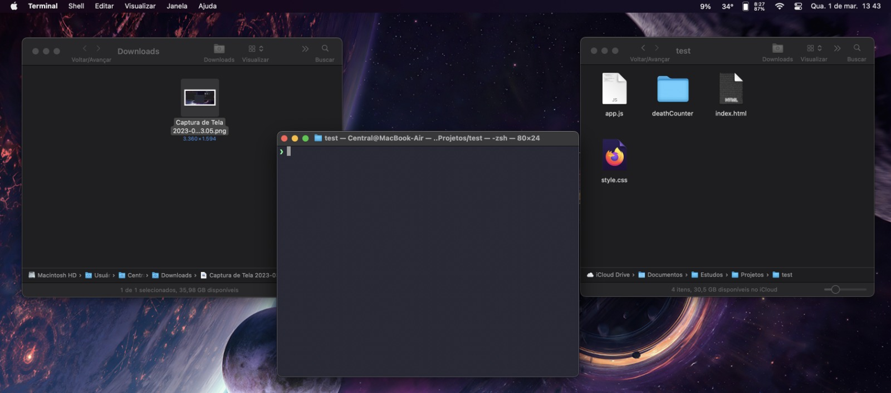

# Fint!

Language: 
  
  

Platform: 
  
  

Coding Language/Framework: 
  

Tools: 
  
  
  

  

## Descrição

Este foi meu primeiro projeto com o objetivo de melhorar minha experiência como dev! Servindo de 1/2 das operações, a outra metade sendo o .zsh, que possibilitou de fazer chamadas mais precisas com comandos fixos, como demonstrado abaixo:

Sem .zsh:
  <pre>~/script/fint {arquivos referenciados}</pre>

Com .zsh:
  <pre>fint {arquivos referenciados}</pre>

### Como funciona?

Para melhor introdução, foi decidido nos primeiros momentos, que o objetivo de fint deverá ser de mover arquivos da pasta de downloads até a pasta atual, sem necessitar de mais do que uma linha de comando, para cumprir essa tarefa, foi se utilizado de condições em bashscript para melhor identificar com a bandeira extra (dada pelo usuário), o item que se almeja!

Existem 3 formas de se referir à arquivos, cada forma mais inclusiva que a última:

1. #### Pelo nome completo
  Este formato será utilizado para quando se há completa certeza sobre o nome do arquivo em questão.

2. #### Apenas o nome
  Para os usuários fans de agruparem por nome, esta opção possibilita justamente isso

3. #### Apenas por extensão
  Para os esquecidos, a melhor forma de encontrar algo sempre será pela extensão

### Passos:
  1. Clone pelo link do github em uma pasta alta (nos breadcrumbs!)
  2. Utilize-o!

## Description

This was my first ever project with the objective to better my experience as a dev! Serving as 1/2 of operations, while the other half being from .zsh, which made it possible to make the most precise calls with static commands, like shown bellow:

Without .zsh:
  <pre>~/script/fint {referred files}</pre>

Com .zsh:
  <pre>fint {referred files}</pre>

### How does it work?

To better introduce it, it was decided in its first moments, that fints objective would be to move files from the downloads folder into the local folder, without necessitating more than one line of command, to fulfill this hardous task, Bashscript conditions were used to better identify which course of action would better fit the criteria given by the user!

There are 3 forms of referral, each one more inclusive than the last:

1. #### File name and extension
  This format is utilized when the user is completely certain of the correct file it wants to move.

2. #### Just the name
  For the users who are fans of organizing files by their names, now you may also group them by it!

3. #### Just the extension
  For the forgetful ones, the best way to find something will forever be by the extension!

### Steps:
  1. Clone it! Preferrebly at the origin point of the file path (or breadcrumbs)
  2. Utilize it!