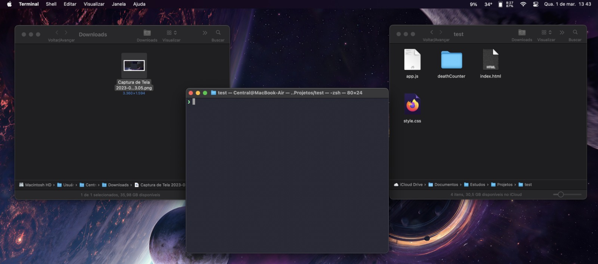
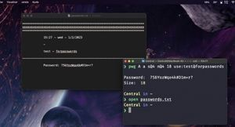
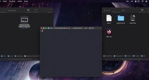

# Workflow Projects

Language: 
  
  

## Projetos de Workflow

    <table>
    <thead>
        <tr>
            <th align="center">
                 
                

                    <small>#</small>
                

            </th>
            <th align="center">
                 
                
 
                    <small>NOME</small>
                

            </th>
            <th align="left">
                
                
 
                    <small>DATA DE LANÇAMENTO</small>
                

            </th>
            <th align="center">
                
                
 
                    <small>IMAGEM</small>
                

            </th>
        </tr>
    </thead>
    <tbody>
        <tr>
            <td>01</td>
            <td><a href="./Fint">Fint</a></td>
            <td>20/03/2022 às 13:17</td>
            <td align="center">
            </td>
        </tr>
        <tr>
            <td>02</td>
            <td><a href="./passwordGenCLI">Gerador de Senhas pelo CLI!</a></td>
            <td>25/04/2022 às 17:02</td>
            <td align="center">
            </td>
        </tr>
    </tbody>
</table>
 

## Workflow Projects

    <table>
    <thead>
        <tr>
            <th align="center">
                 
                

                    <small>#</small>
                

            </th>
            <th align="center">
                 
                
 
                    <small>NAME</small>
                

            </th>
            <th align="left">
                
                
 
                    <small>RELEASE DATE</small>
                

            </th>
            <th align="center">
                
                
 
                    <small>PREVIEW</small>
                

            </th>
        </tr>
    </thead>
    <tbody>
        <tr>
            <td>01</td>
            <td><a href="./Fint">Fint</a></td>
            <td>20/03/2022 at 01:17PM</td>
            <td align="center">
            </td>
        </tr>
        <tr>
            <td>02</td>
            <td><a href="./passwordGenCLI">Password Generator w/CLI!</a></td>
            <td>25/04/2022 at 05:02PM</td>
            <td align="center">
            </td>
        </tr>
    </tbody>
</table>

