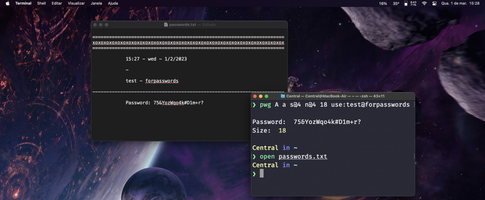

# Password Generator w/CLI!

Language: 
  
  

Coding Language/Framework: 
  

Tools: 
  
  
  

  

## Descrição

Este em outra mão, foi criado para mais fácil gerar senhas sem a necessidade de manter nenhuma em um navegador!

Sem .zsh:
  <pre>~/script/passwordGen.js {código}</pre>

Com .zsh:
  <pre>pwg {código}</pre>

### Como funciona?

Utilizando do comando abaixo:
    <pre>pwg a A s@18 n 32 use:nomeDaMsg@Resumido</pre>
Se é possível definir que:
1. Se deseja uma senha com todos os caracteres disponíveis.
2. Deseja-se 18 simbolos componham os 32 espaços disponíveis
3. Que seja salva sob o nome: nomeDaMsg - Resumido

Para se acessar as senhas criadas, basta abrir a pasta github e haverá um arquivo passwords.txt para visualizar!

### Passos:
  1. Clone pelo link do github no ponto de origem das pastas (dos breadcrumbs!)
  2. Utilize-o!

### Conceitos aprendidos:
1. Expressões Regulares
2. Pacote Clipboardy
3. Função ForEach

## Description

On the other hand, this one was created to more easily generate new passwords, without being locked behind a single browser!

Sem .zsh:
  <pre>~/script/passwordGen.js {code}</pre>

Com .zsh:
  <pre>pwg {code}</pre>

### How does it work?

Utilizing the code bellow:
    <pre>pwg a A s@18 n 32 use:msgName@briefing</pre>
It is possible to define that:
1. Every character available is necessary
2. Out of the 32 available spaces, 18 must be filled in with symbols
3. Saving the password under msgName - briefing is wanted

To access the generated passwords, Theres a secondary txt file present in the copied folder from github, access it!

### Steps:
  1. Clone it via github link at the origin point (of the breadcrumbs!)
  2. Utilize it!

### Concepts learned:
1. Regular expressions
2. Clipboardy package
3. ForEach function